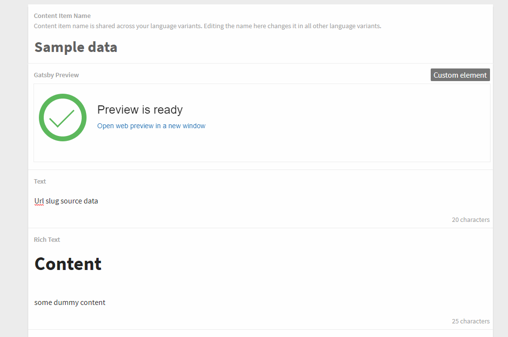

# Kentico Kontent Gatsby Preview Custom Element

Gatsby preview custom element is watching content changes.
When the change is performed it sends the notification to the GatsbyJs and notify editor that the preview environment is ready to be previewed.



## Usage

If you want to use the Gatsby preview custom element in your project in Kentico Kontent, follow these steps:

* In Kentico Kontent open Content types tab
* Open / create a content model to which you want to add the Gatsby preview custom element
* Add **Custom element** content element
* Open configuration of the content element
* Use following URL as Hosted code URL (HTTPS): https://Simply007.github.io/gatsby-preview-custom-element/build/preview-element.html
* Provide the following JSON parameters for the custom element to connect it to the appropriate elements

```jsonc
{
    "previewApiKey": "<YOUR PREVIEW API KEY>",
    "previewUrlPattern": "https://gatby-test-kc-preview/{lang}/{urlslug}",
    "urlSlugElement": "url_pattern",
    "gatsbyWebHookUrl": "https://webhook.gatsbyjs.com/hooks/data_source/<GUID>",
    "baseDomain": "https://your-proxy-for-preview-endpoint.com" // default is "https://preview-deliver.kontent.ai"
}
```

## Setup

1. Deploy the code to a secure public host
    * See [deploying section](#Deploying) for a really quick option
1. Follow the instructions in the [Kentico Kontent documentation](https://docs.kontent.ai/tutorials/develop-apps/integrate/integrating-your-own-content-editing-features#a-3--displaying-a-custom-element-in-kentico-kontent) to add the element to a content model.
    * The `Hosted code URL` is where you deployed to in step 1
    * No JSON parameters are necessary

## Deploying

Netlify has made this easy. If you click the deploy button below, it will guide you through the process of deploying it to Netlify and leave you with a copy of the repository in your GitHub account as well.

[](https://app.netlify.com/start/deploy?repository=https://github.com/Simply007/gatsby-preview-custom-element)

### Development

You can use following to set up the development environment

Prerequisites:

* Node.js
* git

```console
git clone https://github.com/Simply007/gatsby-preview-custom-element
cd gatsby-preview-custom-element
npm install
npm run start
```

To build for production, run:

```console
npm run build
```

then deploy the contents of the `dist` folder.

## Thanks

Thanks to [Martin Hejtmánek](https://github.com/kenticomartinh) and his [Preview availability custom element](https://github.com/kenticomartinh/custom-element-samples/tree/master/PreviewAvailability)
